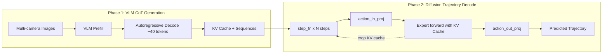
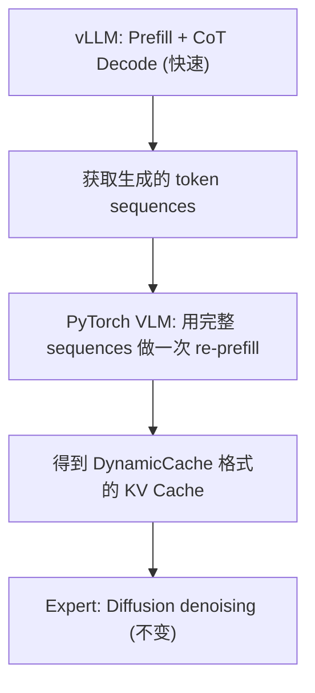

# Alpamayo-R1 推理加速计划

## 当前性能基线

- CoT 推理: ~943ms（论文 ~70ms）
- 轨迹生成: ~263ms（论文 ~8.75ms）
- 总推理: ~1200ms（论文 99ms）
- GPU: RTX PRO 6000 Blackwell (与论文一致)
- 核心瓶颈: HuggingFace 原生 `generate()` 太慢 + diffusion 步数多

## 架构约束

推理管线分两阶段，**Expert model 共享 VLM 的 KV Cache** 是核心约束：

Expert model 每个 diffusion step 都要：读 VLM 的 KV cache -> append -> crop。这使得 vLLM/TensorRT-LLM 的 paged KV cache 难以直接桥接。

---

## Phase 1: 低风险快速优化（预期整体 2-3x 加速）

**目标**: 只改 [test_inference.py](src/alpamayo_r1/test_inference.py) 和 [alpamayo_r1.py](src/alpamayo_r1/models/alpamayo_r1.py)，不改模型架构。

### 1.1 减少 Flow Matching 步数 (10 -> 5)

- **改动位置**: 调用 `sample_trajectories_from_data_with_vlm_rollout` 时传入 `diffusion_kwargs={"inference_step": 5}`
- **影响**: 轨迹生成时间减半（~263ms -> ~130ms），与论文设置一致
- **风险**: 低。论文即使用 5 步也能达到合格的轨迹质量

### 1.2 torch.compile 编译 Expert Model

- **改动位置**: [alpamayo_r1.py](src/alpamayo_r1/models/alpamayo_r1.py) 中 `__init__` 或推理入口
- **做法**: 在模型初始化后，对 `self.expert` 调用 `torch.compile(self.expert, mode="reduce-overhead")`
- **注意事项**:
  - `mode="reduce-overhead"` 使用 CUDA Graph capture，最适合 diffusion loop 这种固定 shape 的重复调用
  - Expert model 的输入 shape 在每次采样内是固定的（`b_star x n_diffusion_tokens x hidden_size`），非常适合编译
  - 首次调用会有编译开销（几十秒），后续调用会显著加速
  - 需验证 `prompt_cache.crop()` 操作与 CUDA Graph 的兼容性。如果不兼容，改用 `mode="default"`（无 CUDA Graph，但仍有 kernel fusion 加速）
- **预期加速**: Expert forward 部分 1.3-1.5x

### 1.3 torch.compile 编译 VLM

- **改动位置**: [alpamayo_r1.py](src/alpamayo_r1/models/alpamayo_r1.py) 或 [test_inference.py](src/alpamayo_r1/test_inference.py)
- **做法**: `torch.compile(model.vlm, mode="default")` — VLM 由于 dynamic sequence length，不适合 `reduce-overhead`
- **注意事项**:
  - HuggingFace `generate()` 内部有大量 Python 控制流，torch.compile 对它的加速有限
  - 主要受益是 prefill 阶段的 kernel fusion
  - 可能需要设置 `torch._dynamo.config.cache_size_limit` 避免重编译
- **预期加速**: CoT 部分 1.2-1.5x

### 1.4 CUDA Graph 手动捕获 Diffusion Step

如果 1.2 的 `reduce-overhead` 模式因为 `crop()` 不兼容而无法使用，可以手动实现 CUDA Graph：

- **改动位置**: [alpamayo_r1.py](src/alpamayo_r1/models/alpamayo_r1.py) 的 `step_fn` 和 diffusion 采样循环
- **做法**: 
  - 将 `step_fn` 的执行 capture 到 CUDA Graph 中
  - 需要将 `prompt_cache` 操作（crop）放在 Graph 外面
  - 这需要稍微重构 `step_fn`，将 expert forward 和 cache crop 分离
- **风险**: 中。需要处理动态 cache 操作

---

## Phase 2: 量化加速（预期在 Phase 1 基础上再 1.3-1.8x）

### 2.1 VLM BF16 -> FP8 动态量化

- **改动位置**: [test_inference.py](src/alpamayo_r1/test_inference.py) 模型加载部分
- **做法**: 使用 `transformers` 的 `BitsAndBytesConfig` 或 `torchao` 的 FP8 量化
- **方案选择**:
  - **torchao (推荐)**: `torchao.quantization.quantize_(model.vlm, torchao.quantization.float8_dynamic_activation_float8_weight())`
  - **bitsandbytes**: `BitsAndBytesConfig(load_in_8bit=True)` — 更简单但可能不支持 Blackwell
- **注意事项**: 需要验证量化后的模型质量（minADE 是否显著退化）
- **预期加速**: VLM prefill 和 decode 都会快 ~1.5x

### 2.2 Expert Model 量化

- 同上方案，对 `self.expert` 也做 FP8 量化
- Expert 每个 diffusion step 都做 forward，量化收益更高

---

## Phase 3: 推理引擎加速 CoT 阶段（预期整体 5-10x 加速）

这是最激进的优化，目标是用 vLLM/SGLang 替代 HuggingFace `generate()` 来做 CoT 生成。

### 3.1 核心难点: KV Cache 桥接

当前架构中 Expert 依赖 VLM 的 `past_key_values`（HuggingFace `DynamicCache` 格式）。vLLM/SGLang 使用 PagedAttention，KV cache 格式不同且不暴露给外部。

**两种可行思路**:

#### 思路 A: 分离 Prefill 和 Decode，仅用推理引擎做 Prefill + Decode，再用 PyTorch 做 Re-prefill

- vLLM 快速生成 CoT tokens（~40 tokens），大幅加速 CoT 阶段
- 然后用原生 PyTorch VLM 对完整序列（prompt + CoT）做一次前向传播，生成 Expert 需要的 KV cache
- **代价**: 多了一次 VLM prefill（但这是 O(n) 的，比自回归 decode 快得多）
- **改动范围**: 需要新建一个推理脚本，用 vLLM 的 `LLM` 或 `AsyncEngine` API 替代 `model.vlm.generate()`
- **难点**: vLLM 加载的 Qwen3-VL 需要与 Alpamayo 的扩展 vocab 匹配

#### 思路 B: SGLang + Hidden States 导出

- SGLang 已支持 `return_hidden_states`（返回最后一层的 hidden states）
- 但它只返回 **last layer hidden states**，不返回完整的 KV cache
- 如果能修改 expert 使其接收 hidden states 做 cross-attention 而非共享 KV cache，可以完全解耦两阶段
- **但这需要重训模型**，不推荐

### 3.2 推荐实施路线: 思路 A（vLLM CoT + PyTorch Re-prefill）

**具体步骤**:

1. **安装 vLLM**: `pip install vllm`
2. **注册自定义模型或 hack vocab**: 让 vLLM 加载带有扩展 vocab 的 Qwen3-VL
  - 最简方案: 将 Alpamayo 的完整 tokenizer 保存到本地，让 vLLM 用这个 tokenizer
  - 可能需要修改 vLLM 的 model loader 以加载 Alpamayo 的 checkpoint（因为它不是标准 Qwen3-VL）
3. **用 vLLM 做 CoT 生成**: 调用 `vllm.LLM.generate()` 获取 CoT token 序列
4. **用 PyTorch VLM 做 Re-prefill**: 将完整序列（input_ids + CoT tokens）喂给 `model.vlm` 做一次 forward，获取 `DynamicCache`
5. **保持 Expert 和 Diffusion 不变**

**需要修改的文件**:

- [test_inference.py](src/alpamayo_r1/test_inference.py): 新增 vLLM 初始化和 CoT 生成逻辑
- [alpamayo_r1.py](src/alpamayo_r1/models/alpamayo_r1.py): 拆分 `sample_trajectories_from_data_with_vlm_rollout` 为两个阶段，允许外部传入 CoT tokens

---

## 实施优先级总结

| 阶段        | 优化项                    | 代码改动量  | 预期效果                | 风险  |
| --------- | ---------------------- | ------ | ------------------- | --- |
| Phase 1.1 | Diffusion 步数 10->5     | 1 行    | 轨迹生成减半              | 极低  |
| Phase 1.2 | torch.compile Expert   | 3-5 行  | Expert 加速 1.3-1.5x  | 低   |
| Phase 1.3 | torch.compile VLM      | 3-5 行  | CoT 加速 1.2-1.5x     | 低   |
| Phase 1.4 | CUDA Graph for step_fn | ~30 行  | Diffusion 加速 1.5-2x | 中   |
| Phase 2.1 | VLM FP8 量化             | 5-10 行 | 整体加速 1.3-1.5x       | 低-中 |
| Phase 2.2 | Expert FP8 量化          | 5-10 行 | Diffusion 加速 1.3x   | 低-中 |
| Phase 3   | vLLM CoT + Re-prefill  | ~100 行 | CoT 加速 5-10x        | 高   |

**建议从 Phase 1.1 开始**，每步测量实际加速效果后再决定下一步。